# TINO — Arquitetura Real do Sistema

**Data:** 23/08/2026  
**Escopo:** Android local-first, agents, voz, A2UI, comércio, fiscal e sync  
**Regra deste documento:** descreve o código existente. O ADK Kotlin oficial
está conectado somente como planner; ele não recebe tools do TINO nem acessa
Room. O Attention Engine local já está integrado ao runtime e à UX; RAG externo
e cloud produtivo continuam fora do produto integrado.

## 1. Visão geral

O TINO é um aplicativo Android local-first. A interface recebe texto, voz ou
toque; a camada agentic interpreta a intenção; as capabilities consultam ou
preparam operações no domínio; a UI mostra uma resposta ou preview; e o Room
continua sendo a fonte local da verdade.

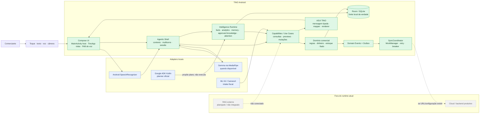

## 2. Fronteiras do projeto

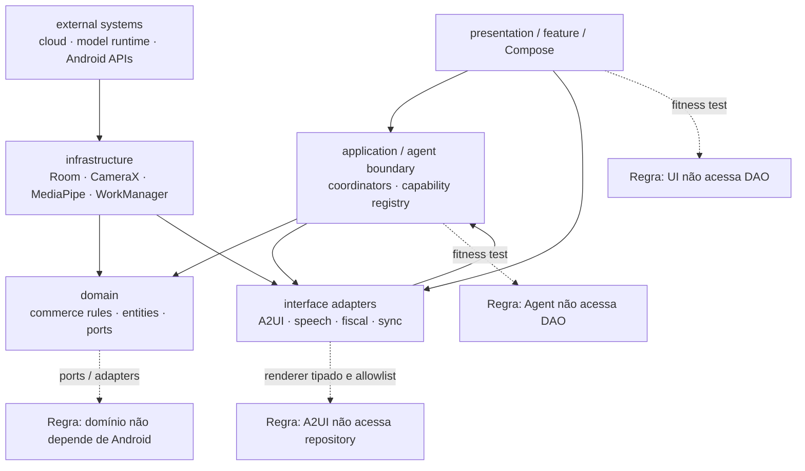

A composição foi extraída do host para `TinoApp.kt`; a navegação foi movida para
`TinoNavigation.kt`; e a Home foi movida para `TinoHome.kt`. Isso preserva a
direção das dependências e permite que `MainActivity` permaneça responsável
apenas pelo startup, splash, orientação, barras do sistema e instalação do
conteúdo Compose. As demais telas ainda estão agrupadas no módulo de
apresentação; a extração por feature continua sendo uma dívida de organização,
não uma justificativa para reescrever o aplicativo.

## 2.1 Perfil de negócio e módulos verticais

O contrato inicial de plataforma já está no domínio em
`domain/profile/BusinessProfile.kt`. Ele modela um único APK com `CORE` sempre
habilitado e módulos ativados por perfil. O `TinoModuleRegistry` possui o pack
Retail inicial e compartilha `TinoCapabilityId` com o Agentic Shell.

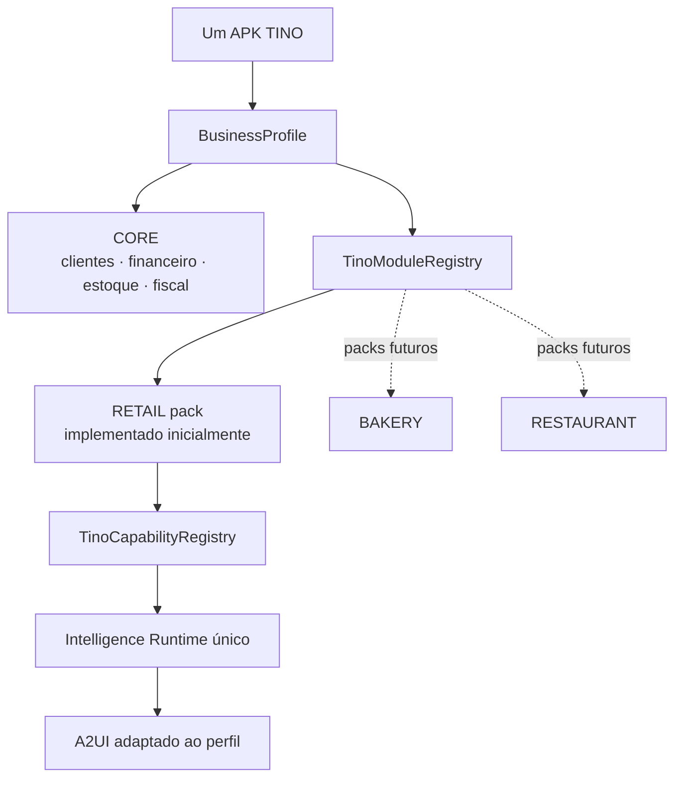

Onboarding, persistência do perfil e packs Bakery/Restaurant ainda não estão
integrados às telas. A fundação impede a criação de aplicativos separados e
deixa a expansão como composição de módulos.

### 2.2 Contrato semântico de A2UI

Capabilities e agentes devolvem resultados semânticos; eles não montam
Compose, escolhem telas ou produzem componentes A2UI arbitrários. A fronteira
`interfaceadapter/a2ui` faz o mapeamento explícito para uma primitive
permitida pelo catálogo:

| Resultado semântico | Primitive A2UI |
| --- | --- |
| Lista/coleção de produtos, clientes ou recebíveis | `ReadListCard` |
| Entidade ambígua que precisa de escolha | `EntityChoice` |
| Resumo de cliente ou financeiro | card semântico correspondente |
| Preview, confirmação ou conclusão de mutação | `ActionConfirmation` |
| Erro recuperável ou timeout | `ErrorStatusCard` (`error_recovery`) com retry |

No bounded context de estoque, perguntas de catálogo e de compra também são
distintas: `LIST_PRODUCTS` retorna todos os produtos cadastrados, enquanto
`REPLENISHMENT_QUERY` aplica `InventoryPolicy(minimumStock, reorderPoint)` e
retorna somente candidatos à reposição. Sem política persistida por produto, o
default é deliberadamente conservador e considera apenas estoque zerado.

O renderer Compose aceita somente componentes tipados e allowlisted. O
`A2uiSemanticMapper` centraliza resultados de recuperação, e o codec preserva
essa primitive no round-trip JSON. Um novo resultado agentic só pode entrar na
interface depois de possuir mapper e teste de contrato; respostas de erro não
devem voltar como `Unsupported(type = "error_recovery")` nem ser desenhadas
por um `TinoCard` ad hoc na Home.

#### Princípio visual: A2UI glanceable

**A2UI deve ser glanceable: entender primeiro, ler depois.** O comerciante
precisa reconhecer o resultado em 1–2 segundos, sem decifrar um parágrafo.
Resultados de coleção carregam semântica visual, não apenas texto solto:

`icon · title · context · primary value · supporting text · status · action`

O contrato continua separado em camadas:

`CapabilityResult → dados visuais semânticos → primitive A2UI permitida → renderer Compose`

O domínio informa o que o resultado significa; o renderer decide espaçamento,
tipografia, ícones, hierarquia, estados de cor e comportamento responsivo. A
LLM não produz Compose, layout ou componentes arbitrários. O valor principal
fica maior e mais legível; contexto e apoio são curtos e opcionais; cards
operacionais não recebem explicações longas.

A família inicial de primitives é deliberadamente pequena: `MetricCard`,
`EntityCard`, `AlertCard`, `SummaryCard`, `List`, `Choice`,
`ConfirmationCard`, `StatusCard`, `MiniChart` e `Action/Button`. A migração
atual começa por `ReadListCard`, cujos itens já preservam esses campos no
codec; novas primitives entram somente quando houver resultado semântico,
mapper, renderer e teste de contrato.

### 2.3 Catálogo customizado v1

O vocabulário de domínio é registrado em `tino.catalog.v1` por
`TinoCustomComponentCatalog`. Ele descreve semântica, props, estados e ações;
não duplica `Text`, `Icon`, `Row`, `Column`, `List`, `Button` ou containers do
Basic Catalog. A lista inicial é:

`MetricCard`, `ProductCard`, `CustomerCard`, `DebtCard`, `InventoryAlertCard`,
`SaleCard`, `SummaryCard`, `QuickQueryCard`, `ConfirmationCard`, `StatusCard` e
`MiniChart`.

O registry central valida props e allowlist antes do renderer. Ações de detalhe
e consulta são agentic e passam pela fronteira de ações; confirmação e
cancelamento continuam explícitos. A superfície atual ainda renderiza alguns
tipos legados durante a migração, mas o catálogo novo já é a fonte versionada
para as próximas composições.

### 2.4 TinoUiPlanner — composição fechada pelo catálogo

O catálogo é o vocabulário; o `TinoUiPlanner` escreve a frase visual. Ele não
cria componentes em runtime e não conhece Compose, Room ou DAO:

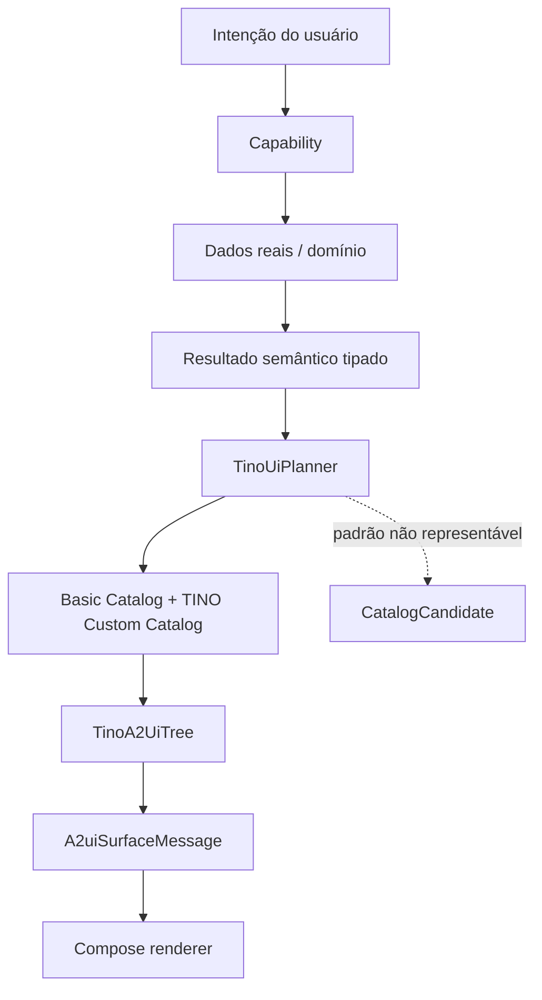

`TinoUiPlannerContext` fornece intenção, largura, escala de fonte e dados
opcionais de série. A composição considera essas restrições sem alterar os
fatos: em tela compacta, por exemplo, o mini-gráfico é omitido se não couber
ou se a série não veio da capability. Cada saída é validada contra
`TinoComponentCatalog.core`; um tipo inventado pelo modelo não pode atravessar
essa fronteira.

Composições v1 cobertas:

- `ReplenishmentResult` → título, `InventoryAlertCard` por produto e ação para estoque;
- `ReceivablesListResult` → `SummaryCard` + `DebtCard` por cliente;
- `FinancialSummaryResult` → `MetricCard` e `MiniChart` somente com série real e espaço suficiente;
- `ProductListResult` e `CustomerListResult` → coleções de cards sem picker indevido;
- padrão não suportado → mensagem segura + `CatalogCandidate` para análise posterior.

`CatalogCandidate` é observação de design, não instrução executável. Telemetria
pode agrupar candidatos recorrentes; somente uma mudança versionada do catálogo
e um novo renderer podem transformá-los em componente disponível.

## 3. Fluxo dos agents

Os agents do TINO não são agentes autônomos com acesso livre ao sistema. São
componentes especializados que trabalham dentro de uma fronteira controlada.

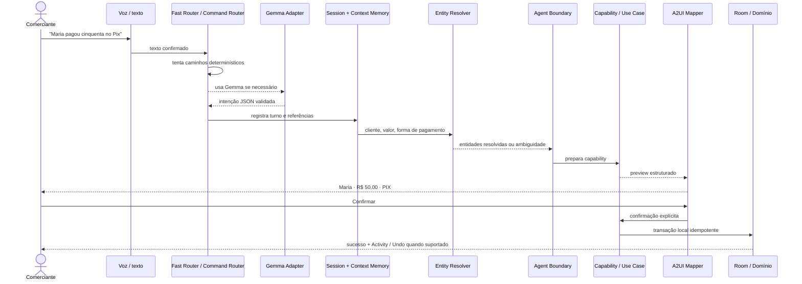

### Responsabilidade de cada agent/camada

| Camada | Responsabilidade | Não faz |
|---|---|---|
| `LiveTranscriber` | Captura e entrega transcrição parcial/final | Não decide o que mutar |
| `FastIntentRouter` / `CommandIntentRouter` | Reconhece frases conhecidas rapidamente | Não consulta saldo ou estoque |
| `MediaPipeGemmaAgentIntentAdapter` | Classifica intenção em JSON estrito | Não acessa Room, não calcula dinheiro |
| `TinoAgentSession` | Estado de listening, understanding, preview, cancel e sucesso | Não é a fonte do domínio |
| `CommerceContextMemory` | Referências de tela, conversa e entidade recente | Não escolhe entidade ambígua silenciosamente |
| `EntityResolver` | Resolve cliente/produto e pede escolha quando necessário | Não grava mutação |
| `AgenticTextQueryCoordinator` | Coordena interpretação, contexto e resposta | Não substitui regras comerciais |
| `Capability Registry / Boundary` | Allowlist de capacidades disponíveis | Não permite tool arbitrária |
| `Use Case / CommerceRepository` | Consulta e mutação local com regras de negócio | Não renderiza Compose |
| `AgentActivityLedger` | Registra operação, estado e Undo | Não é o ledger financeiro |

## 4. Consulta e mutação

Consultas podem retornar dados diretamente. Mutações passam por preview e
confirmação quando a operação exige confirmação.

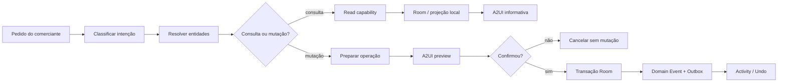

Exemplos atuais incluem saldo, timeline, produtos, estoque, preço, recebíveis,
entrada, alteração de preço, venda fiada e pagamento de fiado. Nem todas as
operações antigas foram promovidas ao catálogo agentic canônico.

## 5. A2UI do TINO

O A2UI atual é um contrato declarativo próprio do TINO (`tino.a2ui`, versão 1).
Ele não é o Google ADK, não é o Room e não é uma segunda camada de domínio.

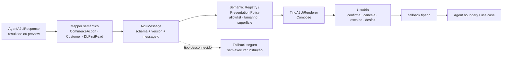

Componentes principais:

- `FinancialSummaryCard`, `CustomerBalanceCard` e `CustomerTimelineCard` para
  consultas;
- `ReadListCard` e `EntityChoice` para listas e desambiguação;
- `ActionConfirmation` e previews de pagamento, fiado, preço e entrada;
- `InsightCard` para respostas do Intelligence Runtime com status, evidências e limitações;
- ações de cancelar, confirmar e Undo quando a capability oferece compensação;
- allowlist e fallback para que mensagem externa não vire código executável.

## 5.1 Intelligence Runtime — fatia executável atual

O runtime atual já possui uma porta única (`IntelligenceRuntimePort`) e uma
implementação determinística local. Ela consulta fatos por uma porta de
infraestrutura que lê Room/projeções, calcula analytics sem LLM e devolve
status explícito quando há ambiguidade, falta de dados ou conhecimento não
disponível.

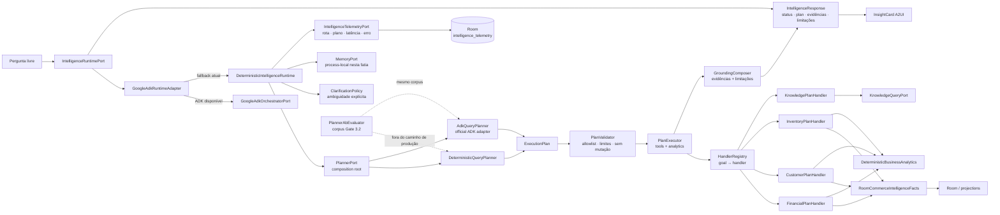

Regras preservadas nesta fronteira:

- fatos de saldo, venda, estoque e recebível vêm de Room/projeções, nunca de memória ou RAG;
- analytics como variação, atraso médio, velocidade e cobertura são determinísticos;
- o registry é allowlist de ferramentas com schema, versão, autorização e política de confirmação;
- este caminho é somente consulta nesta fatia; mutações continuam no pipeline preview → confirmação → capability;
- se o modelo/ADK estiver indisponível, o planner determinístico é usado com
  `plannerUsed=deterministic-fallback`; nenhuma resposta é inventada;
- o ADK oficial propõe somente JSON convertido em `ExecutionPlan`; não recebe
  DAO, repository, handler ou tool executável do TINO.
- telemetria registra `requestId`, `sessionId`, planner selecionado/usado,
  fallback, validação, grounding, ordem de steps, latência e estágio de erro em
  Room, mas não é fonte de fatos comerciais e falha de forma isolada se a
  persistência estiver indisponível;
- `PlannerAbEvaluator` mede os dois planners com o mesmo corpus sem executar
  ferramentas; grounding factual continua sendo responsabilidade do executor.

## 6. Voz e modelos open source

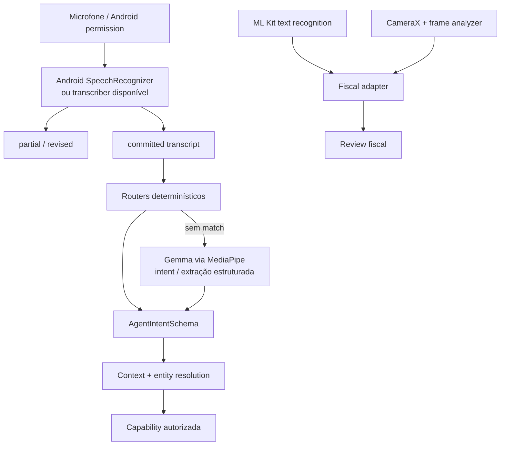

O papel dos componentes open source é delimitado:

- **Gemma/MediaPipe:** ajuda a interpretar linguagem e extrair campos; não é
  fonte de verdade e não executa operação comercial;
- **Android SpeechRecognizer:** transforma fala em texto quando o device possui
  reconhecimento on-device disponível;
- **ML Kit:** reconhece texto/documento fiscal; não decide matching de produto;
- **CameraX:** captura imagem e respeita lifecycle da tela;
- **Room, Compose, Hilt e WorkManager:** infraestrutura Android do produto;
- **Koog:** somente contratos/spike em `koog-spike/`; não é runtime oficial;
- **RAG:** não existe operacionalmente. Saldo, preço e estoque usam Room, não
  recuperação semântica.

## 7. Fluxo fiscal

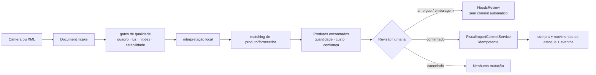

O contrato fiscal já impede que a superfície A2UI ofereça `COMMIT` direto para
um preview ambíguo. Câmera e XML ainda precisam convergir completamente para o
review canônico da `MainActivity` antes de o fluxo fiscal ser fim a fim.

## 8. Offline, eventos e sincronização

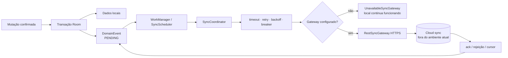

O usuário trabalha no Room mesmo sem cloud. O outbox registra o que precisa
ser sincronizado; isso não deve ser exposto como vocabulário de produto.

## 9. ADK, Koog e RAG: fronteira atual

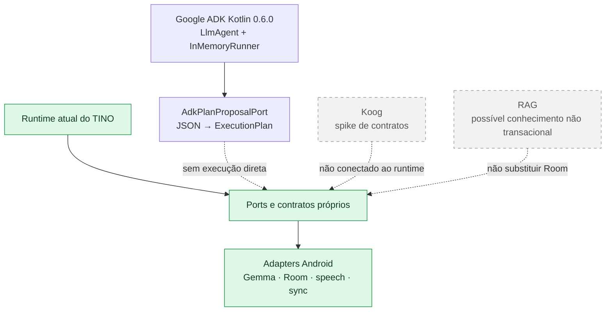

A decisão atual é manter o domínio independente de framework. O build contém
`google-adk-kotlin-core` e usa `LlmAgent`/`InMemoryRunner` em um adapter Android
que reaproveita o Gemma local como backend de texto. O ADK recebe pergunta,
contexto e catálogo descritivo; retorna uma proposta de plano. O domínio valida
allowlist, limites e mutações antes de qualquer handler. O `GoogleAdkRuntimeAdapter`
continua sendo a fronteira externa com fallback seguro. Firebase AI, LiteRT-LM,
RAG e Koog não estão conectados ao runtime produtivo.

## 10. Estado de implementação

| Área | Estado | Observação |
|---|---|---|
| Comércio local | PRONTO | Room, regras, estoque, fiado, pagamentos e fornecedores |
| Agentic Shell | PRONTO/PARCIAL | Sessão, contexto, multiturno e confirmação existem |
| Catálogo agentic | PARCIAL | Nem todas as mutações antigas estão no caminho canônico |
| A2UI | PRONTO como fundação | Contrato, mappers, allowlist e renderer existem |
| Voz real/Gemma | PARCIAL | Depende de modelo, permissão e suporte do device |
| Fiscal | PARCIAL | Intake/review existem; convergência e commit visual faltam |
| Offline/recovery | PRONTO localmente | Cloud produtivo e conflitos ainda não estão configurados |
| ADK | PARCIAL / Gate 3.2 | Core oficial conectado como planner, telemetria Room e eval A/B; backend dedicado, dashboard operacional e memória/RAG ainda faltam |
| Koog | SPIKE | Contratos exploratórios |
| RAG | SÓ NO PAPEL | Não deve substituir fatos transacionais do Room |

## 11. Diagnóstico arquitetural atual

Para esta arquitetura Android local-first, o diagnóstico de system design é
**4/10**. Três dos oito critérios estão atendidos ou parcialmente atendidos:
escopo funcional explícito, caminhos assíncronos de outbox/sync e observabilidade
local redigida.

Ainda faltam:

- estimativas de volume/QPS e retenção para cloud;
- redundância de backend e estratégia de escalabilidade do Room/cloud;
- cache para leituras remotas quando o backend existir;
- monitoramento agregado com alertas;
- estratégia de distribuição progressiva e rollback fora do `adb`.

As correções pertencem a uma futura camada cloud. Não devem ser adicionadas ao
aplicativo local apenas para fazer o diagrama parecer mais distribuído.

## 12. Mapa de código

- Host Android: `app/src/main/java/com/tino/app/MainActivity.kt`
- Composição e estado global (M01): `app/src/main/java/com/tino/app/TinoApp.kt`
- Navegação e shell de telas (segunda fatia M01): `app/src/main/java/com/tino/app/TinoNavigation.kt`
- Home e superfície agentic principal (terceira fatia M01): `app/src/main/java/com/tino/app/TinoHome.kt`
- Agentic Shell: `app/src/main/java/com/tino/app/domain/agent/`
- Contexto e linguagem: `app/src/main/java/com/tino/app/domain/language/`
- Voz/Gemma: `app/src/main/java/com/tino/app/core/speech/`
- A2UI contrato/codec: `app/src/main/java/com/tino/app/interfaceadapter/a2ui/`
- A2UI Compose: `app/src/main/java/com/tino/app/ui/a2ui/`
- Domínio comercial: `app/src/main/java/com/tino/app/domain/commerce/`
- Banco e DAOs: `app/src/main/java/com/tino/app/core/database/`
- Sync e snapshot: `app/src/main/java/com/tino/app/core/sync/`
- Fiscal: `app/src/main/java/com/tino/app/feature/fiscal/` e `tino-fiscal-core/`
- Contratos neutros do spike: `tino-agent-contracts/` e `koog-spike/`
